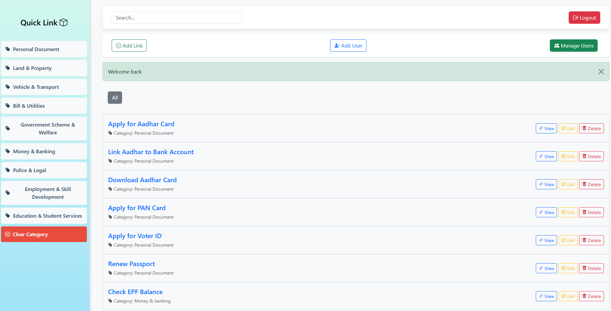

# QuickLink – Centralized Government Services Portal

**QuickLink** is a web application designed to streamline access to important government service links, especially for **eSevai Maiyam** centers and the general public. Instead of searching multiple websites or struggling with outdated URLs, users can directly find and access verified links to services like Aadhaar, Income Certificate, Caste Certificate, and more — all in one place.

---
# QuickLink

---

## 🔗 Project Highlights

* Centralized access to official government links
* Categorized by document type (ID, certificates, tax, etc.)
* Clean and responsive UI for both desktop and mobile
* Role-based access system: User / Admin
* Admin features:

  * Add, edit, or delete service links
  * Add new users
  * Promote users to admin or revoke roles
  * Delete users

---

## 🧰 Tech Stack

* **Backend**: Node.js, Express.js
* **Database**: MongoDB
* **Authentication**: Passport.js (Session-based)
* **Frontend**: EJS templates + Tailwind CSS
* **Other tools**: express-session, connect-flash, method-override

---

## 🔐 Authentication & Authorization

* Users must register and log in to access protected routes.
* Admins have additional permissions:

  * See Edit/Delete buttons for each link
  * Access to user management features (Add User, Manage Users)
* Role stored in the database (`isAdmin` flag)

---

## 🧑‍💻 How It Works

### For Users:

* Register or log in
* Browse or search government links by category
* Click **View** to open the official page
* Logout securely

### For Admins:

* Access dashboard with 3 key controls:

  * **Add Link** – Add new government URLs
  * **Add User** – Create new user accounts and optionally make them admin
  * **Manage Users** – Promote to admin, revoke admin rights, or delete users
* Edit or delete existing links directly from the list

---

## 📦 Installation & Setup

1. Clone this repo
2. Run `npm install` to install dependencies
3. Set up environment variables for MongoDB URI and session secrets
4. Run the server using `npm start` or `nodemon`
5. Visit `http://localhost:PORT`

---
## 🎥 Project Demo – QuickLink

**Author:** Magesh Balram  
📧 **Email:** [mageshbalram@gmail.com](mailto:mageshbalram@gmail.com) 
